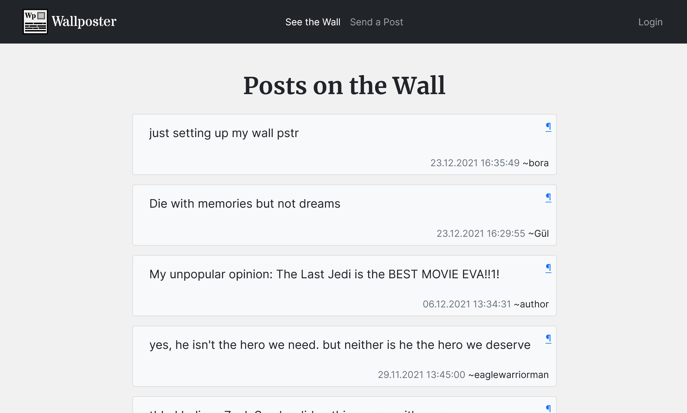
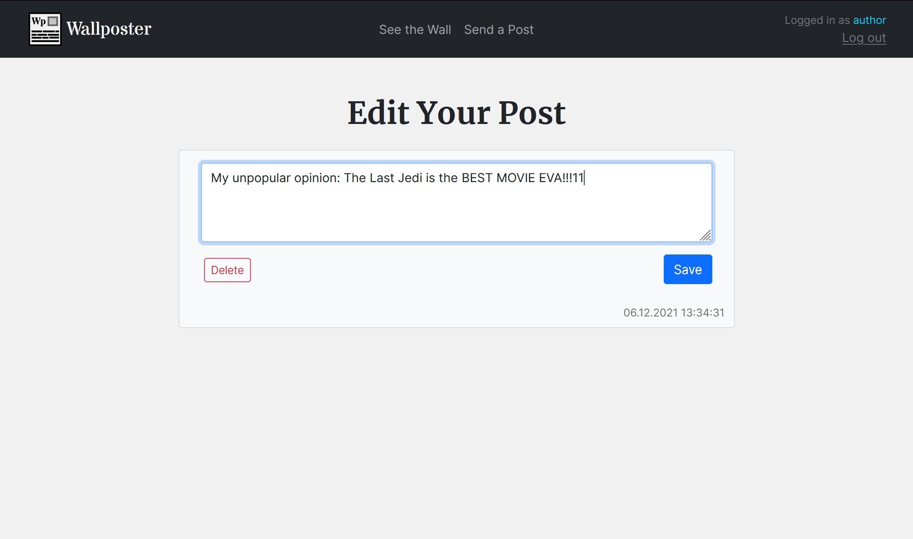
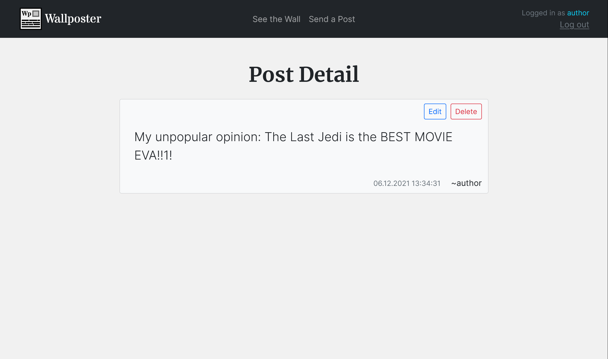
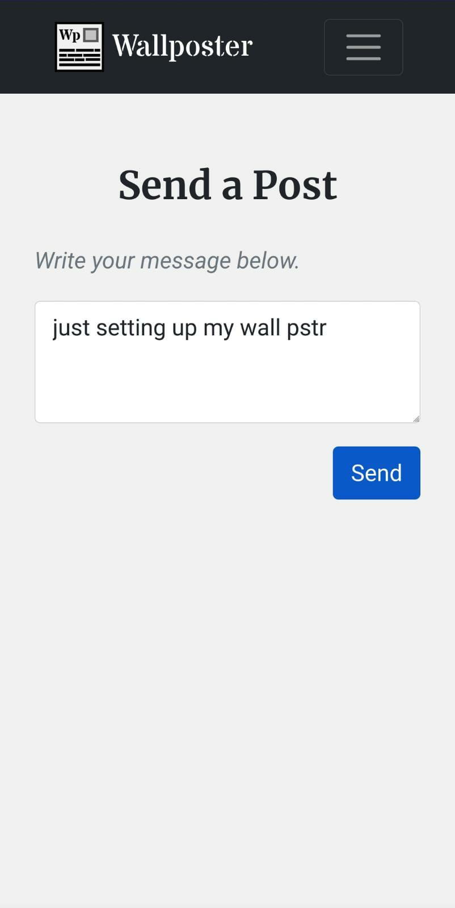

# Wallposter

Wallposter is a simple microblogging website where you can share your opinion with the world. You can put your thought on the wall, or just delete them. 

- CREATE new post on the wall
- READ what others say
- UPDATE your post if you changed your mind
- DELETE your post anytime.

<!--

Wallposter is live on [TO BE ADDED](#)

-->

## Built With

- [NodeJS](https://nodejs.org)
- [Express](https://expressjs.com/)
- [MongoDB](https://www.mongodb.com/)
- [Bootstrap](https://getbootstrap.com/)

## Gallery

## Licence

Distributed under the MIT License. See `LICENSE.txt` for more information.

